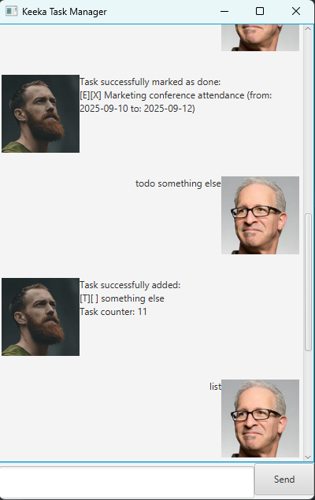

# Keeka User Guide



Keeka is a simple, interactive command-line task manager. It helps you organize your todos, deadlines, and events, mark tasks as done, search, update, and more—all from your terminal.

## Adding deadlines

You can add a deadline task to keep track of tasks that must be completed by a specific date or time.

Usage: `deadline <description> /by <YYYY-MM-DD>`
`deadline <description> /by <YYYY-MM-DDTHH:MM:SS>`

Example: `deadline Submit assignment /by 2024-12-31`
`deadline Submit report /by 2024-12-31T23:59:59`

Expected output displays the deadline task successfully being added to task list in addition to number of tasks in the list

```
Expected Output:

Task successfully added:
  [D][ ] Submit assignment (by: 2024-12-31)
Task counter: 1
```

## Adding todos

Create a simple todo task.

Usage: `todo <description>`

Example: `todo Read book`

Expected output displays the todo task successfully being added to task list in addition to number of tasks in the list

```
Expected Output:

Task successfully added:
  [T][ ] Read book
Task counter: 1
```

## Adding events

Track events with a start and end date/time.

Usage: `event <description> /from <YYYY-MM-DD> /to <YYYY-MM-DD>`
`event <description> /from <YYYY-MM-DDTHH:MM:SS> /to <YYYY-MM-DDTHH:MM:SS>`

Example: `event Team meeting /from 2024-12-25 /to 2024-12-26`
`event Conference /from 2024-12-25T09:00:00 /to 2024-12-25T17:00:00`

Expected output displays the event task successfully being added to task list in addition to number of tasks in the list

```
Expected Output:

Task successfully added:
  [E][ ] Team meeting (from: 2024-12-25 to: 2024-12-26)
Task counter: 1
```

## Listing all tasks

See all your tasks in a numbered list.

Usage: `list`

Expected output displays all tasks with their type, completion status, and details

```
Expected Output:

Displaying list items:
1. [T][ ] Read book
2. [D][ ] Submit assignment (by: 2024-12-31)
3. [E][ ] Team meeting (from: 2024-12-25 to: 2024-12-26)
```

## Marking a task as done

Mark a task as completed.

Usage: `mark <task number>`

Example: `mark 2`

Expected output confirms the task has been marked as done with an X

```
Expected Output:

Task successfully marked as done:
  [D][X] Submit assignment (by: 2024-12-31)
```

## Unmarking a task

Mark a task as not done.

Usage: `unmark <task number>`

Example: `unmark 2`

Expected output confirms the task has been marked as not done with an empty space

```
Expected Output:

Task successfully marked as NOT done:
  [D][ ] Submit assignment (by: 2024-12-31)
```

## Deleting a task

Remove a task from your list permanently.

Usage: `delete <task number>`

Example: `delete 1`

Expected output confirms the task has been deleted and shows the updated task counter

```
Expected Output:

Task successfully deleted:
  [T][ ] Read book
Task counter: 2
```

## Finding tasks

Search for tasks containing a specific keyword.

Usage: `find <keyword>`

Example: `find assignment`

Expected output displays all tasks that contain the keyword in their description

```
Expected Output:

Displaying items that match your query:
2. [D][ ] Submit assignment (by: 2024-12-31)
```

## Updating a task

Update a task's description or date information.

Usage: `update <task number> description <new description>`
`update <task number> date <YYYY-MM-DD or YYYY-MM-DDTHH:MM:SS>`

Example: `update 2 description Submit final assignment`
`update 2 date 2024-12-30`

Expected output confirms the task has been updated with the new information

```
Expected Output:

Task successfully updated:
  [D][ ] Submit final assignment (by: 2024-12-30)
```

## Exiting Keeka

Quit the application gracefully.

Usage: `bye`

Expected output displays a farewell message before closing the application

```
Expected Output:

Bye. Hope to see you again soon!
```

## Error Handling

If you enter an unknown command or invalid input, Keeka will show an appropriate error message to guide you.

Example: `foobar`

```
Expected Output:

Error: Unknown command: foobar
```

## Summary of Features

- **Task Management**: Add todos, deadlines, and events
- **Task Operations**: Mark/unmark tasks as completed
- **Task Organization**: List all tasks in a numbered format
- **Task Modification**: Update task descriptions and dates
- **Task Removal**: Delete tasks permanently
- **Search Functionality**: Find tasks by keyword
- **Persistent Storage**: Tasks are automatically saved and restored
- **User-Friendly Interface**: Clear commands and helpful error messages
- **Date/Time Support**: Flexible date and datetime formats (YYYY-MM-DD and YYYY-MM-DDTHH:MM:SS)

## Task Type Legend

- `[T]` - Todo task
- `[D]` - Deadline task
- `[E]` - Event task
- `[ ]` - Task not completed
- `[X]` - Task completed
